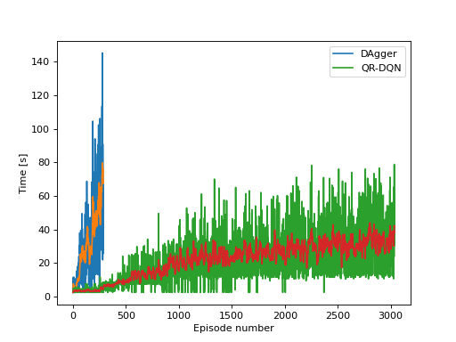

SuperHaxagon
============

A bot for the game Super Hexagon.

# About

**SuperHaxagon** is a _DLL injection_ based bot for the game _Super Hexagon_.

_SuperHaxagon_ was built to explore hooking into an _OpenGL_ (_glut_) application to provide custom drawing and to modify the game state to the user's liking. 
Afterwards it turned into a project making bots capable of playing the game.

There are 3 different AI bot implementations that can beat the game.
A hacky teleportation approach, a natural key emulated approach based on custom heuristics and multiple [reinforcement learning](#reinforcement-learning) approaches.


## Hooking features

 * draw using _OpenGL_ functions,
 * call _glut_ and _fmodex_ functions directly,
 * remove window resizing constraints, 
 * control the game zoom level,
 * control the game rotation and wall speed,
 * change the [game speed](#speedhack),
 * apply shader based filters to change the appearance of the game (Sobel filter in the [fragment shader](SuperHaxagonDLL/Shaders/quad.fs)), 


## Reinforcement learning

The input features for all algorithms is given by preprocessing the game's internal state. 
The output is one of three actions (left, none, right).
The C++ code sends the game's state to the Python server which replies back with the appropriate action.

Example of the processed game state:  
<video src="./figs/dqn_states.mp4" width=300></video>

### Imitation learning

The simplest technique that works best is using imitation learning with the DAgger algorithm. 
It is a combination of supervised learning and exploration.
Random Forests are used for the policy.
The downside of the technique is requiring expert actions.
The expert actions were given by the custom heuristic based approach.

### DQN

A fully connected neural network is used for the DQN implementation.
The network predicts the value of taking an action in a certain state.
Reward shaping is an important part in improving performance, i.e. designing the reward such that it helps the model learn the desired behaviour.

In addition to the implemented DQN algorithm, the code is incorporated into the [stable-baselines3](https://github.com/DLR-RM/stable-baselines3) reinforcement learning framework.
This allows us to change the used RL algorithm with ease (e.g. using [QR-DQN](https://sb3-contrib.readthedocs.io/en/master/modules/qrdqn.html)).

[Optuna](https://optuna.org/) is used for hyperparameter optimization.

Comparison of DAgger and QR-DQN:



# Usage

## DLL hooking

Run with    
```> SuperHaxagon.exe path_to_dll```

where _path\_to\_dll_ is the **absolute** path to _SuperHaxagon.dll_ or place the DLL in the game's main directory.

Access the bot settings menu in-game by pressing the _**middle mouse**_ button.

## Reinforcement learning

`cd py/` and `python server.py` to launch the Python server.  
You must also enable learning using the middle click > _Autoplay settings_ > _DQN_ menu.

### Speedhack

If you want training to be sped up, you can add [speedhack.dll](https://github.com/mare5x/speedhack) to the game's folder and it will be used automatically by the program when training.
You can also use your own speedhack (e.g. CheatEngine works well).


# Installation

## C++ (DLLs)

1. git clone the repo.
2. Open _SuperHaxagon.sln_ and include/link _glad_, _glut_, _[libzmq](https://zeromq.org/)_ inside the _SuperHaxagonDLL_ project.
3. Build _SuperHaxagon_ to get the DLL injector and _SuperHaxagonDLL_ to get _SuperHaxagon.dll_.
4. Copy all DLLs to the game's main directory. For convenience you can find all required DLLs in the bundled release. Included are DLLs for [ZeroMQ](https://zeromq.org/) used for communicating with the Python process.
5. Copy `./SuperHaxagonDLL/Shaders/` to the game's main directory.

## Python

The Python part is required only for reinforcement learning. If you do not need it, skip it.  

Installation with conda:
1. `conda env create -n superhaxagon --file conda_env.yml` to create a new environment and automatically install all required packages.
2. `conda activate superhaxagon` to activate the environment.
