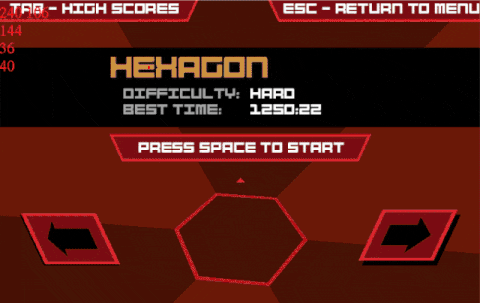

# SuperHaxagon

Super Hexagon bot.

## About

**SuperHaxagon** is a _DLL injection_ based bot for the game _Super Hexagon_.

_SuperHaxagon_ was built to explore hooking into an _OpenGL_ (_glut_) application
to provide custom drawing and to modify the game state to the user's liking.

Additionally, there are 3 different AI bot implementations that can beat the game.
A hacky teleportation approach, a natural key emulated approach and a neural network approach.
The neural network approach is a work in progress.  

  

## Features

_SuperHaxagon_ can:

 * play the game using either natural (_key emulated_) or instant movements,
 * draw using _OpenGL_ functions,
 * call _glut_ and _fmodex_ functions directly,
 * remove window resizing constraints, 
 * control the game zoom level,
 * control the game rotation and wall speed,
 * ...

## Usage

Run with    
```> SuperHaxagon.exe path_to_dll```

where _path\_to\_dll_ is the **absolute** path to _SuperHaxagon.dll_.

Access the bot settings menu in-game by pressing the _**middle mouse**_ button.

### Speedhack

If you want training to be speed up, you can add [speedhack.dll](https://github.com/mare5x/speedhack) to the game's folder and it will be used automatically by the program when training.
You can also use your own speedhack (e.g. CheatEngine works well).

## Build

1. git clone the repo.
2. Open _SuperHaxagon.sln_ and include/link _glad_ and _glut_ inside the _SuperHaxagonDLL_ project.
3. Build _SuperHaxagon_ to get the DLL injector and _SuperHaxagonDLL_ to get _SuperHaxagon.dll_.
